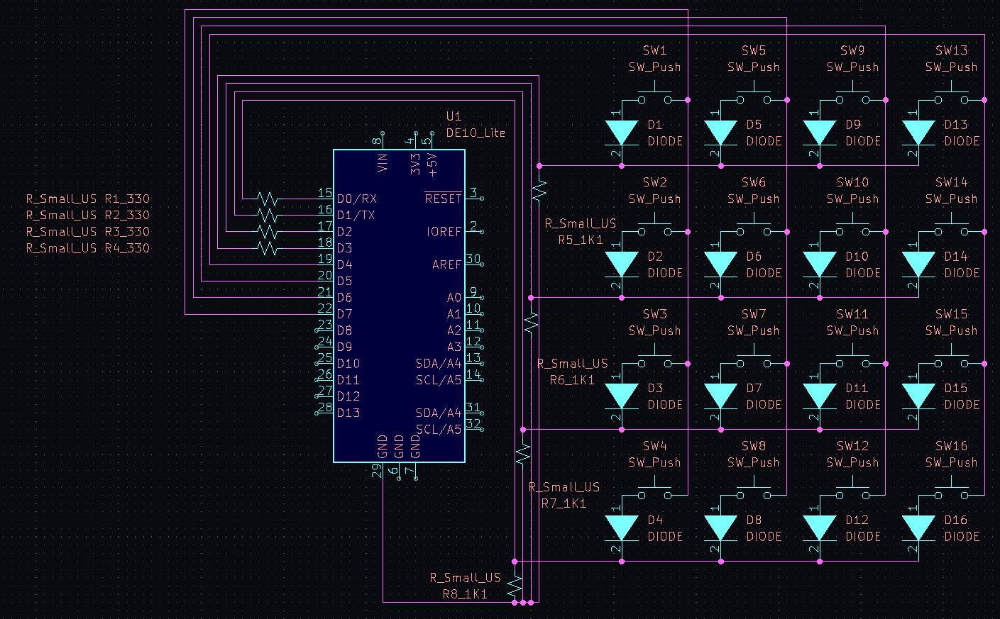
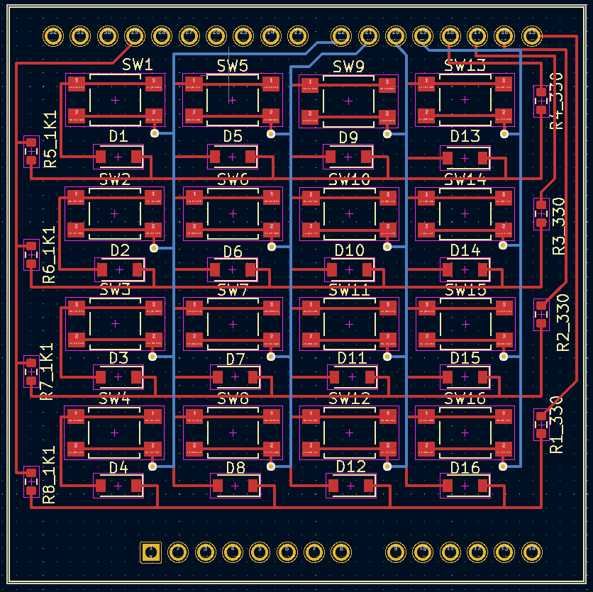
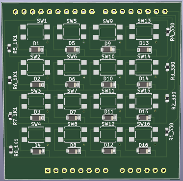

# CPU 6502

A modern design on a PCB keypad with KiCad to be used on the DE10-Lite FPGA or with other similar device pin headers including the Arduino UNO R3.

---

## Repository Structure
The repository is organized as follows:

- `Documentation/`: Holds images and visual assets related to the project.
- `Keypad/`: Includes KiCad project files.
- `PCBWay/`: Contains assembly instructions and pricing documentation.

---

## Schematic

 

---

## PCB

 

---

## 3D Model

 
 

---

## License
This is published under the [MIT License](https://opensource.org/licenses/MIT).
